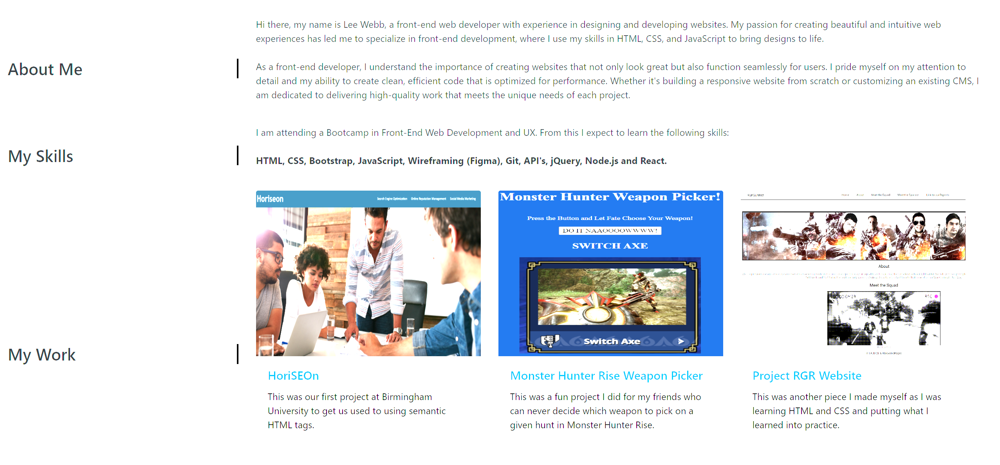

# Module-3-Challenge-Bootstrap-Portfolio

# Creating a Boostrap Portfolio Challenge

## Description

I was tasked with recreating the portfolio from the Module 2 Challenge in Bootstrap, which is far more attractive and a better vehicle to showcase my skills and talents to employers looking to fill full or part-time positons. My portfolio will eventually showcase my strongest work and my though processes behind it. This time I have elected to showcase some of the very minor projects I have done myself as opposed to use the stock ones provided.

I keep in mind that students who have portfolios with deployed web applications (meaning they are live on the web) are typically very successful in their career search after this boot camp. Having several deployed projects is a minimum requirement to receive an initial interview at many companies.

## Installation
Please visit this URL to see how the website looks now: https://halcyonlegion.github.io/Module-3-Challenge-Bootstrap-Portfolio/

## Usage

Along the top of the page is my name along with 4 links which go to the named locations on the page. My icon the Halcyonic Bird features in the top right once more. I have also included a fully linked up Navigate button which links to the page.

The main section contains the About Me, My Skills, My Work and Contact Me areas all of which are linked up. I have included some of my own work this time as well as the Module 1 Challenge. All of these are linked to live pages on my GitHub.

The Contact Me section has links to Birmingham University, Github and Twitter, as well as my icon which will allow you to email my business email address.

## Credits

Roger Le the Instructor for this Bootcamp who has provided a lot of instruction and guidance on the journey so far. This was my first look at Bootstrap and I'm glad it was everything and more.

The University of Birmingham provided the materials and guides I used to get this started: https://www.birmingham.ac.uk/index.aspx

License
There is no license specified for this project.